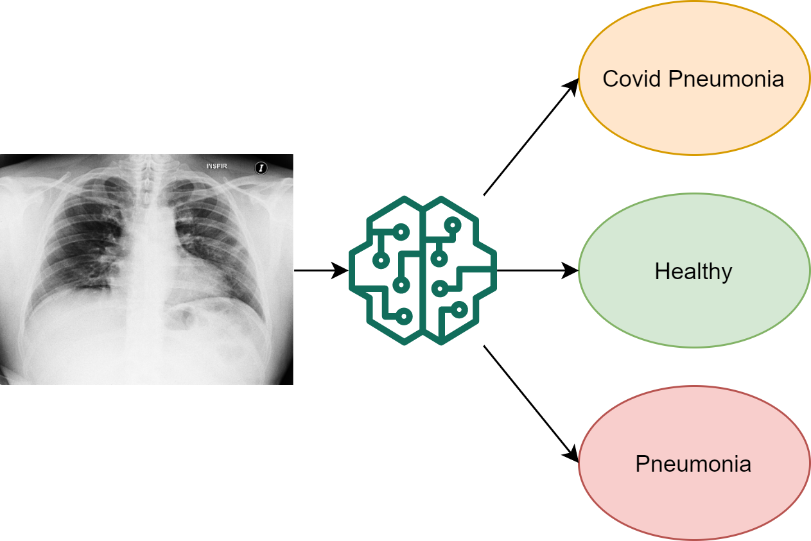
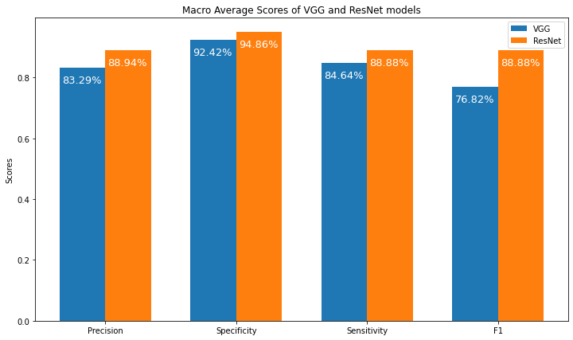

# project1_cxi
This is the GitHub repo for Project 1: COVID-19 Identification in Chest X-ray Images (CXI)  

## Installation
[requirements.txt](https://github.com/qfred008/project1_cxi/blob/master/requirements.txt)
```bash
pip install -r requirements.txt
```

### Setting up OzStar virtual environment

- **Step 1:**  
ssh into remote host (ozstar):

```bash
ssh myusername@ozstar.swin.edu.au
```
- **Step 2:**  
To create a virtual environment using anaconda, load the anaconda module from OzStar, like:
```bash
module load anaconda3/5.1.0
```
This should load anaoconda for python3.  
Then we create a new virtual environment using anaconda3
```bash
conda create -n yourenvname 
```
Then press `y` to proceed.

- **Step 3:**  
To activate the virtual environment, simply run:
```bash
conda activate yourenvname
```
- **Step 4:**  
Load necessary modules:
```bash
module load opencv/3.4.1
```
To utilize GPU devices if available, the following modules are needed:
```bash
module load cudnn/7.6.5-cuda-10.1.243
module load gcc/6.4.0
module load openmpi/3.0.0
```

- **Step 5:**  
Install requirements using:
```bash
pip install -r requirements.txt
```
## Data
### Resources:
 The final dataset was collected from the following resources:
- [COVID-19 image data collection](https://github.com/ieee8023/covid-chestxray-dataset)
- [Figure 1 COVID-19 Chest X-ray Dataset Initiative](https://github.com/agchung/Figure1-COVID-chestxray-dataset)
- [Actualmed COVID-19 Chest X-ray Dataset Initiative](https://github.com/agchung/Actualmed-COVID-chestxray-dataset)
- [COVID-19 Radiography Database](https://www.kaggle.com/tawsifurrahman/covid19-radiography-database)

### Data Checking 
To understand the data better, the data was checked in [data_checking.ipynb](https://github.com/qfred008/project1_cxi/blob/master/data-checking/data_checking.ipynb) for different stats and attributes of the data.  
### Data Merging
The [Merged_Dataset_Final.ipynb](https://github.com/qfred008/project1_cxi/blob/master/Merged_Dataset_Final.ipynb) notebook shows the process of merging the datasets into one dataset with the following labels:
- healthy
- pneumonia
- covid_pneumonia

### Data Exploration
[merged_data_final.csv](https://github.com/qfred008/project1_cxi/blob/master/Merged_Dataset_Final.ipynb) is explored visually and we have seen different types of X Ray images like axial view, side view and front view in general terms.
File used to do EDA was [data_exploration.ipynb](https://github.com/qfred008/project1_cxi/blob/master/data_exploration.ipynb).
### Rest of data tasks:
- [Data Preprocessing.ipynb](https://github.com/qfred008/project1_cxi/blob/master/Data%20Preprocessing.ipynb)
- [Data Augmentation.ipynb](https://github.com/qfred008/project1_cxi/blob/master/Data%20Augmentation.ipynb)

## Training
The script for training the models are in:
- For VGG: [VGG-Model_Training.py](https://github.com/qfred008/project1_cxi/blob/master/VGG-Model_Training.py)
- For ResNet: [train-resnet.py](https://github.com/qfred008/project1_cxi/blob/master/train-resnet.py)

The slurm code of the models has all necessary resources to be requested from OzStar.  
Assuming you are in the project's directory, to train a model, first make the model *.sh* file executable, like

```bash
chmod +x ./VGG_Submit_train_slurm.sh
```
Then you can execute the slurm code in the *.sh* file, like
```bash
./VGG_Submit_train_slurm.sh
```

After training the models, the model weights are stored in the following files:
- For VGG:  
```bash
vgg16_weights_tf_dim_ordering_tf_kernels.h5
vgg16_weights_tf_dim_ordering_tf_kernels_notop.h5
```
- For ResNet:
```bash
resnet50_weights_tf_dim_ordering_tf_kernels_notop.h5
```
## Hyperparameter Tuning
Different combinations of batch_sizes, optimizers, and number of epochs were used to find the best configuration of each model.
### For VGG
The code for hyperparameter tuning of the models is in:
- [Final_HyperTuning.py](https://github.com/qfred008/project1_cxi/blob/master/Final_HyperTuning.py)

To run the hyperparameter tuning, obtain the best model, and save evaluation, the following slurm code is used:
- [Submit_train_slurm.sh](https://github.com/qfred008/project1_cxi/blob/master/Submit_train_slurm.sh)
And the best model is saved in: `Covid19_model.h5`
### For ResNet:
Similar to VGG, the python code for hyperparameter tuning, slurm script are stored in:
- [finetune-resnet_3.py](https://github.com/qfred008/project1_cxi/blob/master/Resnet%20fine%20tuning/finetune-resnet_3.py)
- [finetune-resnet_3.sh](https://github.com/qfred008/project1_cxi/blob/master/Resnet%20fine%20tuning/finetune-resnet_3.sh)
The `3` in the filenames indicate different versions of the hyperparameter tuning process, which generated the best model and stored it as: `finetune-resnet50.h5`
## Performance Evaluation & Comparison
The models were evaluated thoroughly and compared in a visually informative manner, in the following notebook:
- [PerformanceEvaluation_And_Comparison.ipynb](https://github.com/qfred008/project1_cxi/blob/master/PerformanceEvaluation_And_Comparison.ipynb)

